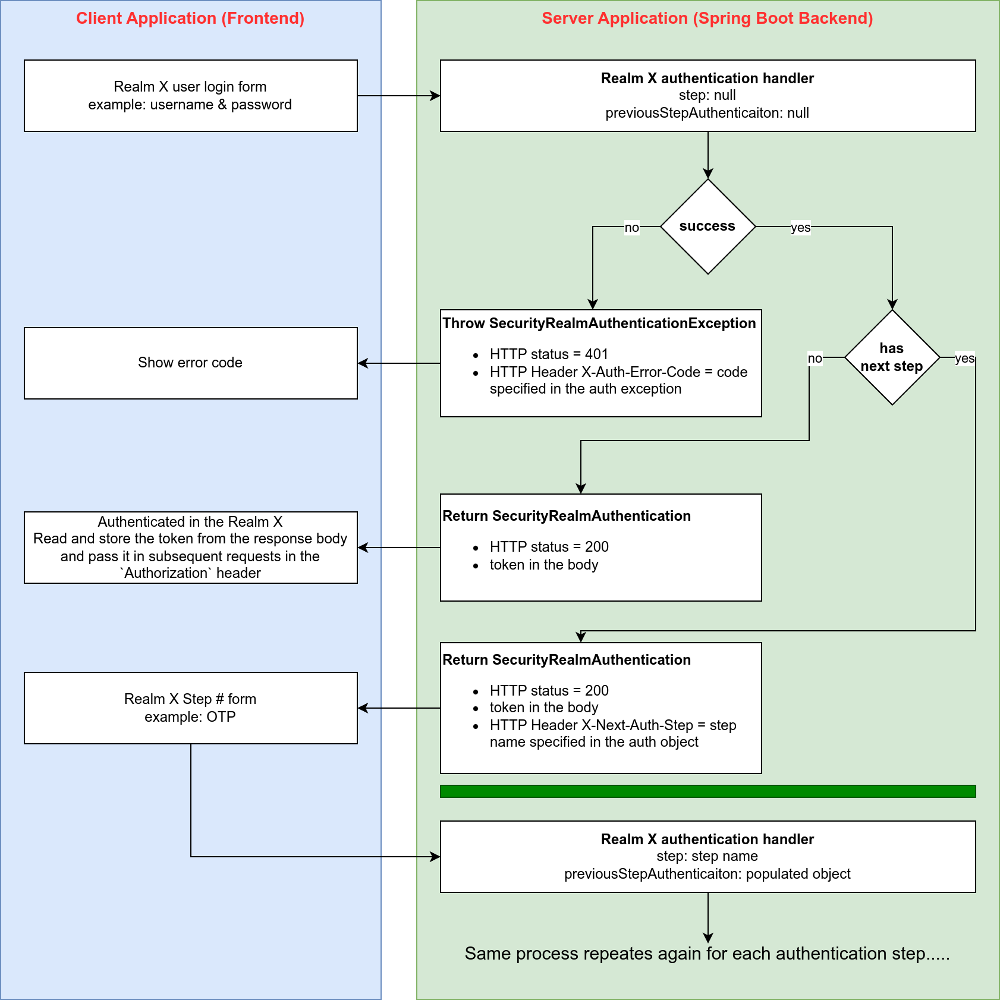

# Spring Multi Security Realms

Support multiple security realms in a single Spring Boot application.

## What is a Security Realm

A realm is a scope of operations. A security realm is a security scope which defines protected resources and users in that realm.

For example, suppose you have a multi-tenant online e-store application. This application probably have these types of users:

- admin users / support users (realm)
- store owner users (realm)
- store customer users (realm)

These different user types are probably authenticated (login mechanism/flow/steps) and authorized (different protected APIs) differently.
Configuring this in Spring can be tricky and a bit complicated.

## Why `spring-boot-starter-multi-security-realms`

This library allows you to easily and declaratively define these realms. It also packs in extra features like:

- Multi steps authentication support (e.g. username & password step, then OTP step). You don't have to think about how to implement this, just use the built-in
  support.
- Ability to define public apis per realm without the need to access and update the `SecurityFilterChain` manually.
  This is helpful if your application is huge, and you want to define public apis in segregated modules without the need to define them in a central place.
- You still have full control and can inject this library in a single `SecurityFilterChain` if you wish and have multiple `SecurityFilterChain`. By default,
  this library creates a default `SecurityFilterChain` and injects the multi realm support into it.
- Supports any type of `SecurityContextRepository`. By default, this library creates a default repository of type `HttpSessionSecurityContextRepository` if you
  don't already have
  one.

## Usage

### Requirements

- Spring Boot >= 3.x.x

### Installation

Maven:

```xml

<dependency>
    <groupId>net.coder966.spring</groupId>
    <artifactId>spring-boot-starter-multi-security-realms</artifactId>
    <version>0.0.2</version>
</dependency>
```

Gradle:

```groovy
implementation 'net.coder966.spring:spring-boot-starter-multi-security-realms:0.0.2'
```

### Setup

Optionally, if you define a custom `SecurityFilterChain` then you need to add this filter `MultiSecurityRealmAuthenticationFilter`
before `AnonymousAuthenticationFilter`.

```java

@Slf4j
@Configuration
@EnableMethodSecurity
@RequiredArgsConstructor
public class SecurityConfig {

    @Bean
    protected SecurityFilterChain globalSecurityFilterChain(
            HttpSecurity http,
            MultiSecurityRealmAuthenticationFilter multiSecurityRealmAuthenticationFilter // inject this filter
    ) throws Exception {

        // this is optional. If you don't have a custom SecurityFilterChain then you don't need to do all of this
        // A default SecurityFilterChain is configured out of the box.

        // add it before AnonymousAuthenticationFilter
        http.addFilterBefore(multiSecurityRealmAuthenticationFilter, AnonymousAuthenticationFilter.class);

        // the reset of your configuration ....

        return http.build();
    }

}
```

### Define security realms

To define a realm, simple create a bean of type `SecurityRealm`.
Here in this example, we define two realms (normal-user & admin-user).

```java

@AllArgsConstructor
@Configuration
public class TestConfig {

    private final NormalUserRepo normalUserRepo;
    private final AdminUserRepo adminUserRepo;

    @Bean
    public SecurityRealm<NormalUser> configureNormalUserRealm() {
        return new SecurityRealm<NormalUser>(
                "NORMAL_USER", // realm role name
                "/normal-user/login", // realm login url
                "/normal-user/logout" // realm logout url
        )
                // optionally define public apis.
                .publicApi(AntPathRequestMatcher.antMatcher("/normal-user/my-first-open-api"))
                .publicApi(AntPathRequestMatcher.antMatcher("/normal-user/my-second-open-api"))

                .setFirstAuthStep(request -> {
                    // WARNING: FOR DEMO PURPOSE ONLY

                    String username = request.getHeader(Headers.USERNAME);
                    String password = request.getHeader(Headers.PASSWORD);

                    Optional<NormalUser> optionalUser = normalUserRepo.findByUsername(username);
                    if (optionalUser.isEmpty()) {
                        // to indicate authentication error, throw a SecurityRealmAuthenticationException 
                        // with the error code to tell the client frontend how to deal with it or to display an appropriate message.
                        throw new SecurityRealmAuthenticationException(ErrorCodes.BAD_CREDENTIALS);
                    }
                    NormalUser user = optionalUser.get();


                    // WARNING: FOR DEMO PURPOSE ONLY
                    if (!user.getPassword().equals(password)) {
                        // to indicate authentication error, throw a SecurityRealmAuthenticationException 
                        // with the error code to tell the client frontend how to deal with it or to display an appropriate message.
                        throw new SecurityRealmAuthenticationException(ErrorCodes.BAD_CREDENTIALS);
                    }

                    // TODO: send otp to mobile
                    String otp = "1234"; // random
                    user.setOtp(otp);
                    user = normalUserRepo.save(user);

                    // to indicate authentication success, return a new SecurityRealmAuthentication 
                    // If you want the user to complete a further authentication step, specify its name in SecurityRealmAuthentication constructor arguments.
                    return new SecurityRealmAuthentication<>(user, user.getUsername(), null, StepNames.OTP);
                })
                .addAuthStep(StepNames.OTP, (previousStepAuth, request) -> {
                    String otp = request.getHeader(Headers.OTP);

                    NormalUser user = previousStepAuth.getPrincipal();

                    if (!user.getOtp().equals(otp)) {
                        throw new SecurityRealmAuthenticationException(ErrorCodes.BAD_OTP);
                    }

                    // clear otp
                    user.setOtp(otp);
                    user = normalUserRepo.save(user);

                    return new SecurityRealmAuthentication<>(user, user.getUsername(), null);
                });
    }

    @Bean
    public SecurityRealm<AdminUser> configureAdminUserRealm() {
        return new SecurityRealm<AdminUser>(
                "ADMIN_USER", // realm role name
                "/admin-user/login", // realm login url
                "/admin-user/logout" // realm logout url
        )
                .setFirstAuthStep(request -> {
                    // WARNING: FOR DEMO PURPOSE ONLY

                    String username = request.getHeader(Headers.USERNAME);
                    String password = request.getHeader(Headers.PASSWORD);

                    Optional<AdminUser> optionalUser = adminUserRepo.findByUsername(username);
                    if (optionalUser.isEmpty()) {
                        throw new SecurityRealmAuthenticationException(ErrorCodes.BAD_CREDENTIALS);
                    }
                    AdminUser user = optionalUser.get();


                    // WARNING: FOR DEMO PURPOSE ONLY
                    if (!user.getPassword().equals(password)) {
                        throw new SecurityRealmAuthenticationException(ErrorCodes.BAD_CREDENTIALS);
                    }

                    // TODO: send otp to mobile
                    String otp = "1234"; // random
                    user.setOtp(otp);
                    user = adminUserRepo.save(user);

                    return new SecurityRealmAuthentication<>(user, user.getUsername(), null, StepNames.OTP);
                })
                .addAuthStep(StepNames.OTP, (previousStepAuth, request) -> {
                    String otp = request.getHeader(Headers.OTP);

                    AdminUser user = previousStepAuth.getPrincipal();

                    if (!user.getOtp().equals(otp)) {
                        throw new SecurityRealmAuthenticationException(ErrorCodes.BAD_OTP);
                    }

                    // clear otp
                    user.setOtp(otp);
                    user = adminUserRepo.save(user);

                    return new SecurityRealmAuthentication<>(user, user.getUsername(), null);
                });
    }
}
```

### Client Application (Frontend)

This image explains the authentication flow


### Realm Protected APIs

To protect an api so that it can only be used by a certain realm users, add `@PreAuthorize("hasRole('<realm-role-name>')")` to the controller itself or the
controller method.

Example:

```java
// adding this hear, will apply it for all the endpoints in this controller
@PreAuthorize("hasRole('ADMIN_USER')")
@RestController
public class AdminUserController {

    // OR it can be defined here at the method level
    @PreAuthorize("hasRole('ADMIN_USER')")
    @GetMapping("/admin-user/my-name")
    public String myName(@AuthenticationPrincipal AdminUser adminUser) {
        return adminUser.getName();
    }

}
```

## License

```txt
Copyright 2023 Khalid H. Alharisi

Licensed under the Apache License, Version 2.0 (the "License");
you may not use this file except in compliance with the License.
You may obtain a copy of the License at

    http://www.apache.org/licenses/LICENSE-2.0

Unless required by applicable law or agreed to in writing, software
distributed under the License is distributed on an "AS IS" BASIS,
WITHOUT WARRANTIES OR CONDITIONS OF ANY KIND, either express or implied.
See the License for the specific language governing permissions and
limitations under the License.
```